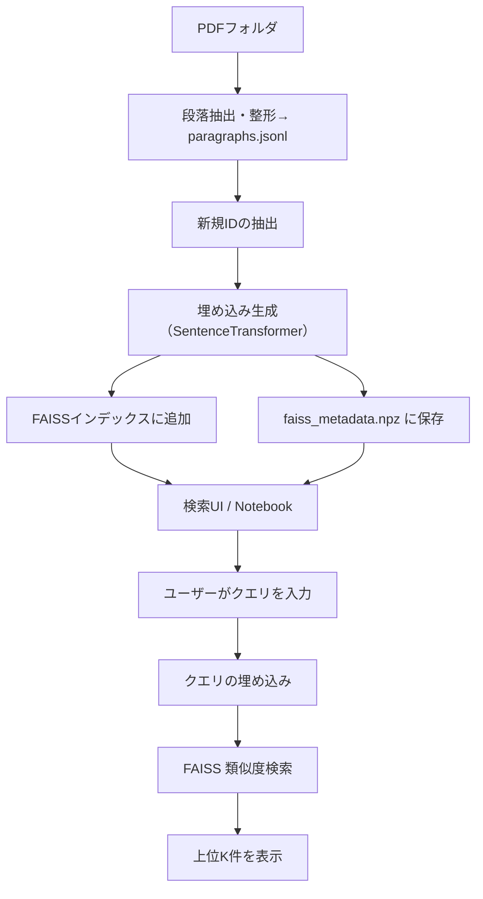

# 📄 README（日本語）

## 🌐 概要

このプロジェクトは、論文のpdfから段落を抽出し、SentenceTransformerでベクトル化し、FAISSを使って高速な類似文検索を行います。大量の論文を効率的かつ橫断的に検索したい研究者や開発者に最適です。

## 🔁 処理フロー



## 🔧 セットアップ手順

### 1. 必要なライブラリをインストール

```bash
pip install faiss-cpu sentence-transformers ipywidgets numpy python-dotenv google.generativeai
```

### 2. `.env`ファイルを作成し、検索の対象とするPDFフォルダのパスと(必要に応じて)Gemini APIキー、Zotero APIキーを記入

例：

```env
PDF_FOLDER=G:/マイドライブ/zoterosync
GEMINI_API_KEY=your-gemini-api-key-here
ZOTERO_API_KEY=your-zotero-api-key-here
ZOTERO_USER_ID=111111111
```

### 3. PDF抽出を実行

`extract.ipynb`をJupyter Notebookで開き、一番上のセルを実行。
指定したPDFフォルダから段落を抽出し、`paragraphs.jsonl`をスクリプト実行フォルダ内に作成します。
（論文PDF1500ファイルで概ね8分ほどかかりました）

### 4. 埋め込み & FAISS構築

`create_faiss.ipynb`を開き、`paragraphs.jsonl`をロードして埋め込みを生成します。
スクリプト実行フォルダ内に`faiss_index.bin` と `faiss_metadata.npz`を作成します。
初回以降はjsonlとの差分のみを確認して上記ファイルを更新します。 
（10分～数10分かかります）

### 5. Notebookで検索UIを起動

`search.ipynb`でクエリを入力して段落を検索します。
基本的にクエリは英語のみ対応しています。
セルごとに検索時の追加機能が変わりますので冒頭の#コメント参照してください。
Zoteroで開くボタン付きのセルでは、Zotero API keyとIDを.envに入力しておくと、該当する論文をZotero側で選択するボタンを使えます。

「平均ベクトルからの論文タイトル検索」とコメントのあるものは段落から抽出したベクトルの平均をとることで
段落ではなく、論文そのものを検索するものです。

回答生成機能のあるセルでは、引用した文献の内容をAPIに送り、自動的に回答生成します。
一部は日本語のクエリにも対応しています（APIによる翻訳を使用）。
Gemini APIを使用する場合無料枠を超えると課金されますのでご注意ください。
ローカル環境のOllamaでMistral 7Bを使用したセルも作ってありますが
回答の質はいまいちです。

`graph.ipynb`でクエリを入れる、あるいは論文選択すると類似した論文でグラフネットワークを生成します。
平均ベクトルを使用しています。
htmlを作成して、ネットワーク表示するものと、Jupyter上で開くものの２タイプがあります。

## 📁 ファイル構成

- `paragraphs.jsonl`: 抽出された段落のマスターファイル
- `faiss_index.bin`: FAISSの類似検索用インデックス
- `faiss_metadata.npz`: 段落テキストとメタ情報（ID、タイトル、ページなど）
- `extract.ipynb`: 対象フォルダ内のすべてのpdfからテキスト抽出するNotebook
- `create_faiss.ipynb`: `paragraphs.jsonl`をロードし、FAISS構築を行うNotebook
- `search.ipynb`: Jupyterベースの検索GUI
- `graph.ipynb`: Jupyterベースのグラフネットワーク生成GUI
- 
## License

This project is licensed under the [GNU Affero General Public License, Version 3.0](./LICENSE).

- The AGPL license text can be found in [LICENSE](./LICENSE).
- This project uses PyMuPDF (AGPL) and other third-party libraries (Apache, MIT, BSD, etc.). See [THIRD_PARTY_LICENSES.txt](./THIRD_PARTY_LICENSES.txt) for details.
