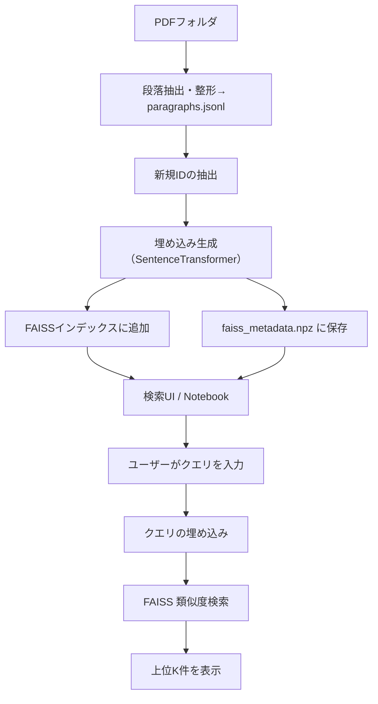

# 📄 README（日本語）

## 🌐 概要

このプロジェクトは、論文のpdfから段落を抽出し、SentenceTransformerでベクトル化し、FAISSを使って高速な類似文検索を行います。大量の論文を効率的かつ橫断的に検索したい研究者や開発者に最適です。

## 🔁 処理フロー



## 🔧 セットアップ手順

### 1. 必要なライブラリをインストール

```bash
pip install faiss-cpu sentence-transformers ipywidgets numpy python-dotenv google.generativeai
```

### 2. `.env`ファイルを作成し、対象とするPDFフォルダと Gemini APIキーを記入

例：

```env
PDF_FOLDER=G:/マイドライブ/zoterosync
GEMINI_API_KEY=your-gemini-api-key-here
```

### 3. PDF抽出を実行

`extract.ipynb`をJupyter Notebookで開き、指定したPDFフォルダから段落を抽出し、`paragraphs.jsonl`を作成します。

### 4. 埋め込み & FAISS構築

`create_faiss.ipynb`を開き、`paragraphs.jsonl`をロードして埋め込みを生成、差分みで `faiss_index.bin` や `faiss_metadata.npz`を作成します。

### 5. Notebookで検索UIを起動

`search.ipynb`を Jupyter Notebook で開き、クエリを入力して段落を検索します。
Gemini APIを使用する場合無料枠を超えると課金されますのでご注意ください。

## 📁 ファイル構成

- `paragraphs.jsonl`: 抽出された段落のマスターファイル
- `faiss_index.bin`: FAISSの類似検索用インデックス
- `faiss_metadata.npz`: 段落テキストとメタ情報（ID、タイトル、ページなど）
- `extract.ipynb`: 対象フォルダ内のすべてのpdfからテキスト抽出するNotebook
- `create_faiss.ipynb`: `paragraphs.jsonl`をロードし、FAISS構築を行うNotebook
- `search.ipynb`: Jupyterベースの検索GUI
