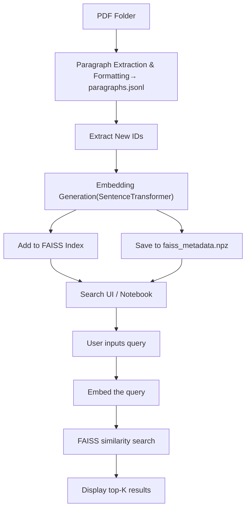

# 📄 README

## 🌐 Overview

This project extracts paragraphs from academic PDFs, encodes them using SentenceTransformer, and performs fast similarity search using FAISS. It is ideal for researchers and developers who want to efficiently and comprehensively search a large collection of academic papers.

## 🔁 Workflow



## 🛠️ Setup Instructions

### 1. Install required libraries

```bash
pip install faiss-cpu sentence-transformers ipywidgets numpy python-dotenv google.generativeai
```

### 2. Create a `.env` file and enter the target PDF folder path and Gemini API key
Example:

```env
PDF_FOLDER=G:/MyDrive/zoterosync
GEMINI_API_KEY=your-gemini-api-key-here
```

### 3. Extract text from PDFs

Open `extract.ipynb` in Jupyter Notebook and extract paragraphs from PDFs located in the specified folder to create `paragraphs.jsonl`.

### 4. Generate embeddings & build FAISS index

Open `create_faiss.ipynb`, load `paragraphs.jsonl`, generate embeddings, and perform differential updates to create `faiss_index.bin` and `faiss_metadata.npz`.

### 5. Launch the search UI in Notebook

Open `search.ipynb` in Jupyter Notebook, enter queries, and search for similar paragraphs.

## 📁 File Structure

- `paragraphs.jsonl`: Master file of extracted paragraphs
- `faiss_index.bin`: FAISS vector index for similarity search
- `faiss_metadata.npz`: Contains paragraph text and metadata (ID, title, page, etc.)
- `extract.ipynb`: Notebook that extracts text from all PDFs in the specified folder
- `create_faiss.ipynb`: Notebook that loads `paragraphs.jsonl` and builds the FAISS index
- `search.ipynb`: Search GUI in Jupyter Notebook

