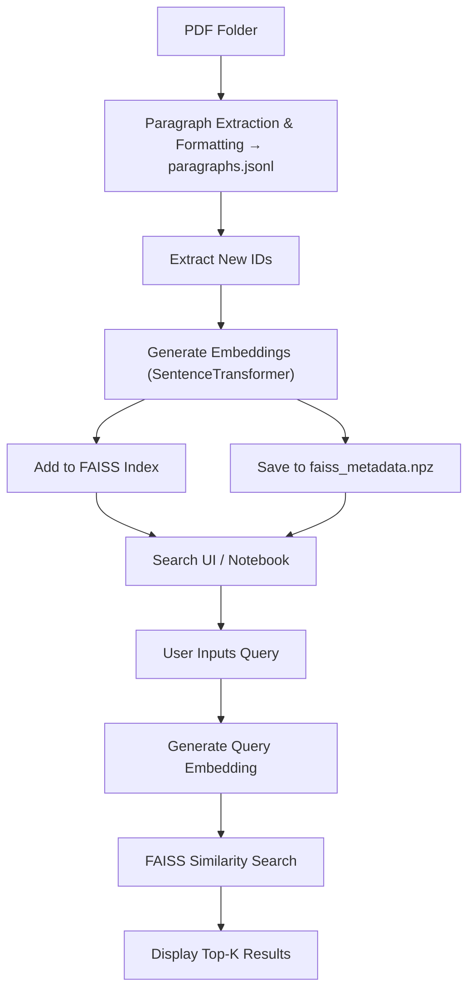

# 📄 README (English)

## 🌐 Overview

This project extracts paragraphs from academic paper PDFs, converts them into vectors using SentenceTransformer, and enables fast similarity search using FAISS. It is ideal for researchers and developers who want to efficiently and comprehensively search across a large number of academic papers.

## 🔁 Processing Flow



## 🔧 Setup Instructions

### 1. Install Required Libraries

```bash
pip install faiss-cpu sentence-transformers ipywidgets numpy python-dotenv google.generativeai
```

### 2. Create a `.env` File

Specify the path to the target PDF folder and, if needed, your Gemini API key and Zotero API key.

Example:

```env
PDF_FOLDER=G:/MyDrive/zoterosync
GEMINI_API_KEY=your-gemini-api-key-here
ZOTERO_API_KEY=your-zotero-api-key-here
ZOTERO_USER_ID=111111111
```

### 3. Extract Text from PDFs

Open `extract.ipynb` in Jupyter Notebook and run the first cell.  
It will extract paragraphs from all PDFs in the specified folder and save them as `paragraphs.jsonl` in the script execution folder.  
(For 1500 PDFs, it took approximately 8 minutes.)

### 4. Generate Embeddings & Build FAISS Index

Open `create_faiss.ipynb` to load `paragraphs.jsonl` and generate embeddings.  
This will create `faiss_index.bin` and `faiss_metadata.npz` in the script folder.  
After the initial run, it will update only the differences.  
(This step may take between 10 to several tens of minutes.)

### 5. Launch Search UI in Notebook

Use `search.ipynb` to input queries and search paragraphs.  
Queries are supported in English only.  
Each cell provides different search features—refer to the `#` comments at the top of each cell (Japanese only, sorry).  

In cells with Zotero integration, entering your Zotero API key and user ID in `.env` enables buttons that allow you to open the relevant paper in Zotero.

Some cells also support automatic answer generation based on the content of retrieved citations.  
If using Gemini API, note that charges may apply after exceeding the free tier.  
Cells using Mistral 7B via local Ollama are also included, though the quality of the responses may be limited.

## 📁 File Structure

- `paragraphs.jsonl`: Master file of extracted paragraphs
- `faiss_index.bin`: FAISS index for similarity search
- `faiss_metadata.npz`: Metadata including paragraph text, ID, title, page, etc.
- `extract.ipynb`: Notebook to extract text from all PDFs in the target folder
- `create_faiss.ipynb`: Notebook to load `paragraphs.jsonl` and build the FAISS index
- `search.ipynb`: Jupyter-based search GUI

## License

This project is licensed under the [GNU Affero General Public License, Version 3.0](./LICENSE).

- The AGPL license text can be found in [LICENSE](./LICENSE).
- This project uses PyMuPDF (AGPL) and other third-party libraries (Apache, MIT, BSD, etc.). See [THIRD_PARTY_LICENSES.txt](./THIRD_PARTY_LICENSES.txt) for details.
